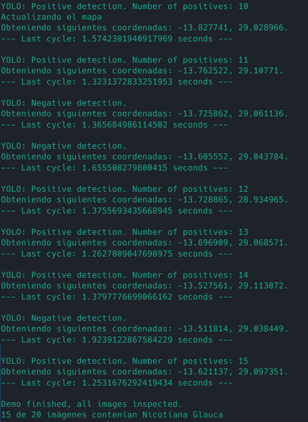

# GREENS POC
> Proof of concept to showcase GREENS project functionality.

## Table of Contents
* [General Info](#general-information)
* [Functioning](#functioning)
* [Setup](#setup)
	* [Docker installation](#docker-installation)
	* [Execution from source code](#execution-from-source-code)
* [Usage](#usage)
* [Room for Improvement](#room-for-improvement)
* [Technologies Used](#technologies-used)
* [Project Status](#project-status)
* [Acknowledgements](#acknowledgements)
* [Contact](#contact)
* [Screenshots](#screenshots)


## General Information
Proof of concept for GREENS project. It demonstrates how the different systems and technologies used can be integrated in a simple, lightweight container. GREENS is aimed to detect Nicotiana Glauca. It then updates the map with the new location and known climatic factors and generates new coordinates with high probability of existence for the plant. Interesting code is found in /codigo/controlador.py (controller and main program), /yolo/yolo.py (decision script for yolo) and /R/DEF_update_map.r (map updating script).

## Functioning
The execution of the proof of concept is orchestrated by the Controller module. To simulate real-time vision of environment, the program extracts images one by one from sample folder. Then, it calls YOLO interpretation module and receives a boolean response for wether or not objective plants are detected in it. If the response is positive, it stores current coordinates and generates new ones to go search there. Once there are 10 positive detections, the probability map is updated. The controller cycle repeats until there are no more images in folder.

## Setup
### Docker installation
There is a fully working Docker container image ready to download and run. To do so, follow these instructions:
- Install docker:
```
apt install docker
```
- Download container image from repository.
- Run image:
```
docker run --name greens_poc -d greens
```
- Connect to container terminal:
```
docker exec -it greens_poc /bin/bash
```
Then, proceed to usage.
### Execution from source code
In order to execute source code, dependencies must be installed. 
- Python installation:
```
apt install python3
apt install pip
```
- Python libraries installation:
```
pip install torch
git clone https://github.com/ultralytics/yolov5
cd yolov5
pip install -r requirements.txt
```
- Java installation
```
apt install -y openjdk-8-jdk openjdk-8-jre
```
- R installation
```
apt install R
```
- R libraries installation
```
apt install libgdal-dev
```
- Configure Java JDK for R
```
R CMD javareconf JAVA_HOME=/usr/lib/jvm/java-8-openjdk-amd64/
```
- In R shell:
```
install.packages('geodata', repos='http://cran.us.r-project.org')
install.packages('terra', repos='http://cran.us.r-project.org')
install.packages('dismo', repos='http://cran.us.r-project.org')
install.packages('rJava', repos='http://cran.us.r-project.org')
install.packages('raster', repos='http://cran.us.r-project.org')
```
Then, proceed to usage.
## Usage
To execute the proof of concept, use:
```
python3 /root/codigo/controlador.py
```
Or, alternatively:
```
/root/codigo/controlador.py
```

Main controller program outputs information, but important logs are kept in /root/log/log_file.txt.
To watch output live:
```
tail -f /root/log/log_file.txt
```
## Room for Improvement
- Output parsing responsibility should be moved from Controller class to a new one.
- Visualization tool should be used to better show program logs.

#### Technologies Used
- Python3
- R
- YOLO
- Google Collab (In YOLO's training phase)

#### Project Status
Proof of concept is complete. Any additions, comments and requests are welcomed in the Issues page, which will be reviewed periodically.

#### Acknowledgements
- This program was created as a project for Aplicaciones Telemáticas Avanzadas during 2023 Spring semester in Universidad Politécnica de Madrid.
- Working group for project: Adolfo Trocolí Naranjo, Alberto Arrojo Rivera,  Mohamed Amin Idrissi Farhane, Sergio Roca Montesa, María Sánchez Martínez.
- Responsible teacher for subject: José Fernán Martínez Ortega.


#### Contact
Created by [@adolfo-trocoli](github.com/adolfo-trocoli)
LinkedIn [profile](https://www.linkedin.com/in/adolfo-trocol%C3%AD-naranjo-a07250224)


## Screenshots
- Log screenshot:



